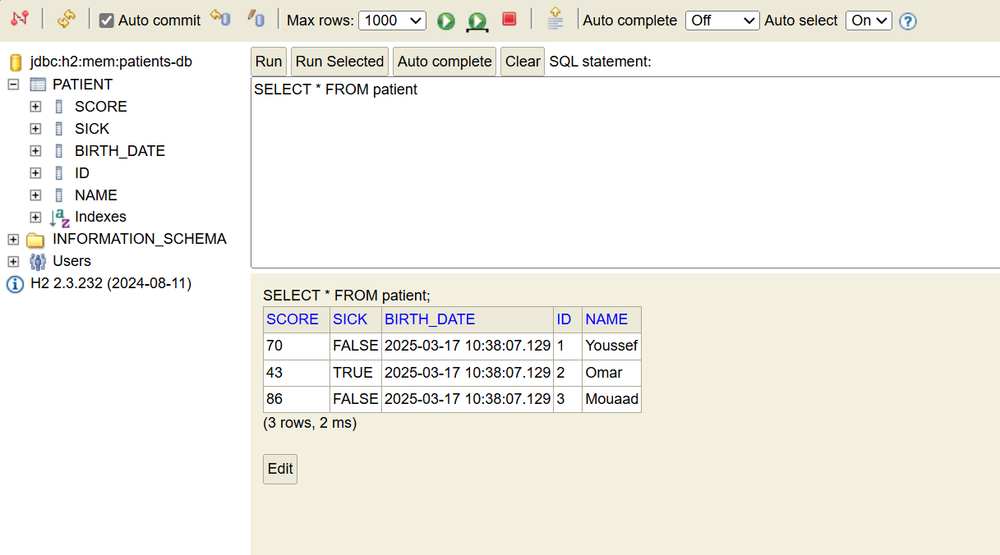
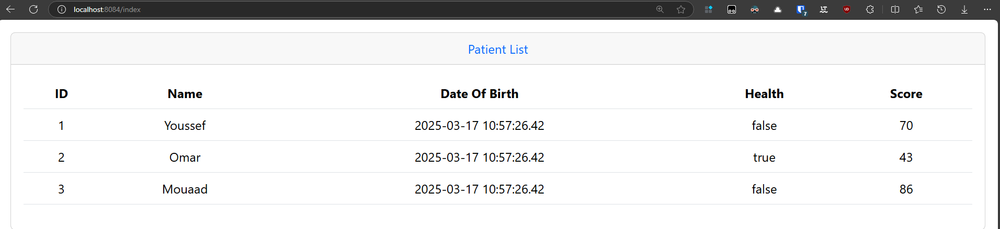
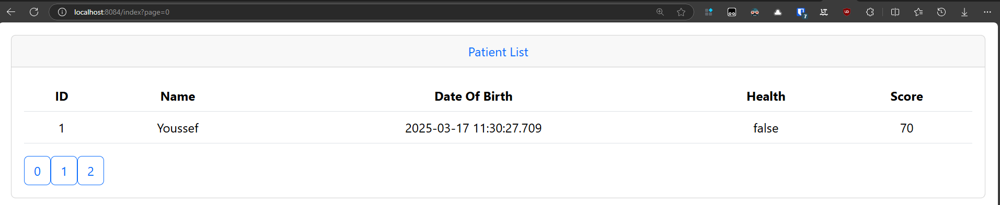
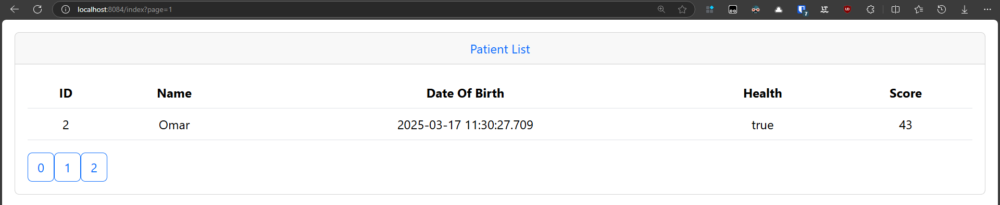
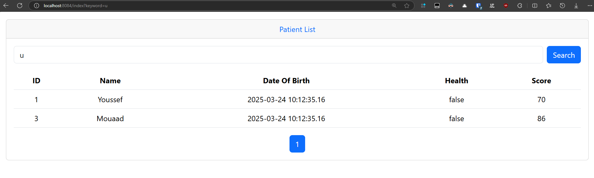
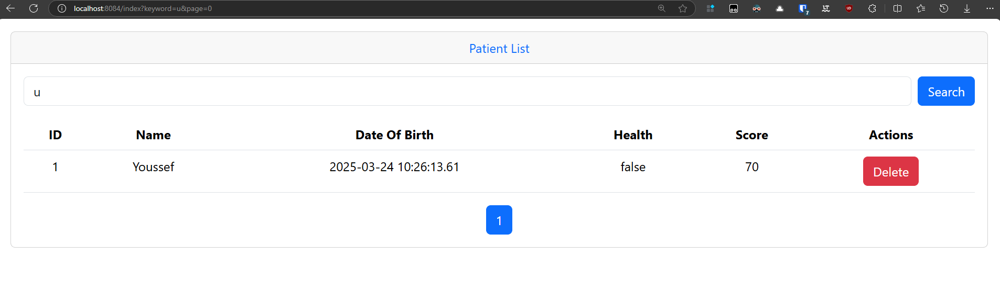

# JEE-TP3-Hospital
 
## Partie 1
Créer une application Web JEE basée sur Spring MVC, Thylemeaf et Spring Data JPA qui permet de gérer les patients. L'application doit permettre les fonctionnalités suivantes :

### Afficher les patients
#### À travers la base de données

#### À travers la page d'accueil

### Ajout de pagination

### Ajout de recherche

### Ajout de la suppression
